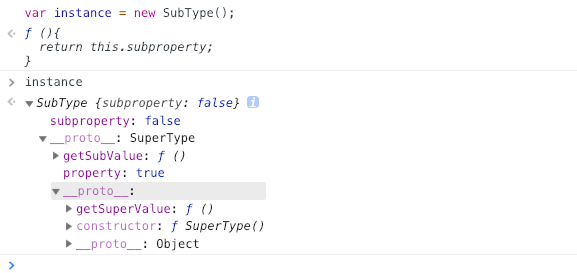
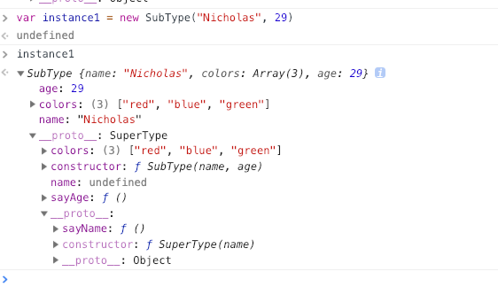
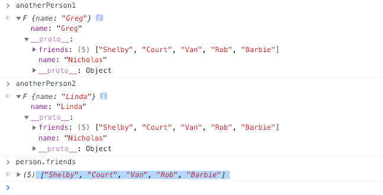
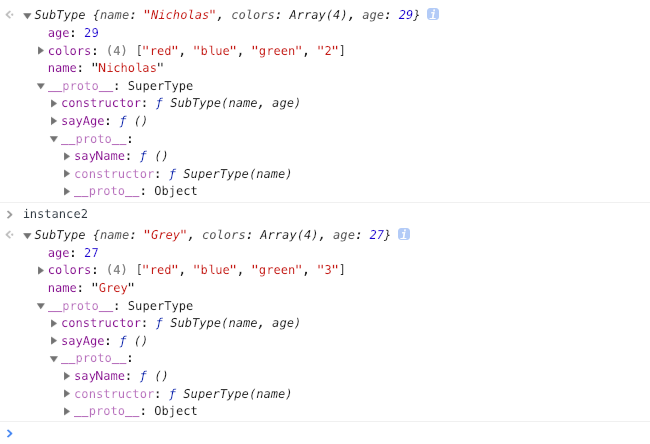

> 继承，通俗的说，就是将自身不存在的属性或方法，通过某种方式为自己所用

##### 1. 原型链继承

> 核心：将父类的实例作为子类的原型

```
function SuperType(){
    this.property = true;
}
SuperType.prototype.getSuperValue = function(){
    return this.property;
};

function SubType(){
    this.subproperty = false;
}
// 继承自SuperType
SubType.prototype = new SuperType();

SubType.prototype.getSubValue = function (){
    return this.subproperty;
};

const instance = new SubType();
console.log(instance.getSuperValue())//true
```

输出instance看下：



原型链：instance --> SubType.prototype --> SuperType.prototype

在《JavaScript中的原型和原型链》里我们分析过，使用原型创建对象会存在多个实例对引用类型的操作会被篡改的问题，比如：

```
function SuperType(){
    this.colors = ["red", "blue", "green"];
}
function SubType(){}

SubType.prototype = new SuperType();

const instance1 = new SubType();
instance1.colors.push("black");
console.log(instance1.colors); //"red,blue,green,black"

const instance2 = new SubType();
console.log(instance2.colors); //"red,blue,green,black"
```
两个实例对象instance1和instance2的colors属性指向相同，改变一个会影响另一个实例的属性

缺陷：原型链继承多个实例的引用类型属性指向相同，存在篡改的可能

##### 2. 借用构造函数继承

> 核心：使用父类的构造函数来增强子类实例，等同于复制父类的实例给子类（不使用原型）

```
function SuperType(name){
    this.name = name;
    this.colors = ["red", "blue", "green"];
}

function SubType(name, age){
    // 继承自SuperType
    SuperType.call(this, name);
  
    this.age = age;
}

const instance1 = new SubType("Nicholas", 29);
instance1.colors.push("black");
console.log(instance1.colors);    //"red,blue,green,black"

const instance2 = new SubType();
console.log(instance2.colors);    //"red,blue,green"

console.log(instance1.name); // "Nicholas"
console.log(instance1.age); // 29
```
借用构造函数继承的核心就在于SuperType.call(this, name)，“借调”了SuperType构造函数，这样，SubType的每个实例都会将SuperType中的属性复制一份

缺陷：
1. 只能继承父类的实例属性和方法，不能继承原型属性/方法
2. 无法实现复用，每个子类都有父类实例函数的副本，影响性能

##### 3. 组合继承

> 核心：结合原型链继承和构造函数继承通过调用父类构造，继承父类的属性并保留传参的优点，然后通过将父类实例作为子类原型，实现函数复用

其背后的思路是使用原型链实现对原型属性和方法的继承，而通过借用构造函数来实现对实例属性的继承，这样，既通过在原型上定义方法实现了函数复用，又能保证每个实例都有它自己的属性

```
function SuperType(name){
    this.name = name;
    this.colors = ["red", "blue", "green"];
}
SuperType.prototype.sayName = function(){
    console.log(this.name);
};

function SubType(name, age){
    //继承属性
    SuperType.call(this, name);
    this.age = age;
}

// 继承方法
SubType.prototype = new SuperType(); 
SubType.prototype.constructor = SubType; 
SubType.prototype.sayAge = function(){
    console.log(this.age);
};

const instance1 = new SubType("Nicholas", 29);
instance1.colors.push("black");
console.log(instance1.colors); //"red,blue,green,black"
instance1.sayName(); //"Nicholas";
instance1.sayAge(); //29

const instance2 = new SubType("Greg", 27);
console.log(instance2.colors); //"red,blue,green"
instance2.sayName(); //"Greg";
instance2.sayAge(); //27
```



缺陷：父类中的实例属性和方法既存在于子类的实例中，又存在于子类的原型中，不过仅是内存占用，因此，在使用子类创建实例对象时，其原型中会存在两份相同的属性/方法

既然不希望父类的实例属性出现在子类的原型中，而只是单纯想要父类原型上的属性，那么我们可以直接将父类的原型属性拷贝过去

```
function extendProto(Child, Parent) {
    let c = Child.prototype;
    let p = Parent.prototype;
    for (let i in p) {
        c[i] = p[i];
    }
};
```

```
function SuperType(name){
    this.name = name;
    this.colors = ["red", "blue", "green"];
}
SuperType.prototype.sayName = function(){
    console.log(this.name);
};

function SubType(name, age){
    //继承属性
    SuperType.call(this, name);
    this.age = age;
}

// 继承方法
extendProto(SubType, SuperType)
SubType.prototype.sayAge = function(){
    console.log(this.age);
};

const instance1 = new SubType("Nicholas", 29);
instance1.colors.push("black");
console.log(instance1.colors); //"red,blue,green,black"
instance1.sayName(); //"Nicholas";
instance1.sayAge(); //29

const instance2 = new SubType("Greg", 27);
console.log(instance2.colors); //"red,blue,green"
instance2.sayName(); //"Greg";
instance2.sayAge(); //27
```


很明显，SubType的原型属性相较之前清爽不少

##### 4. 原型式继承

> 核心：直接将某个对象直接赋值给构造函数的原型

```
function object(obj){
    function F(){};
    F.prototype = obj;
    return new F();
}
```

```
const person = {
    name: "Nicholas",
    friends: ["Shelby", "Court", "Van"]
};

const anotherPerson1 = object(person);
anotherPerson1.name = "Greg";
anotherPerson1.friends.push("Rob");

const anotherPerson2 = object(person);
anotherPerson2.name = "Linda";
anotherPerson2.friends.push("Barbie");

console.log(person.friends);//["Shelby", "Court", "Van", "Rob", "Barbie"]
```



缺点：
1. 原型链继承多个实例的引用类型属性指向相同，存在篡改的可能
2. 无法传递参数

另外，ES5中存在Object.create()的方法，能够代替上面的object方法，感兴趣的可以了解一下

##### 5. 寄生式继承

> 核心：在原型式继承的基础上，增强对象，返回构造函数

```
function createAnother(original){ 
    const clone = object(original); // 创建一个新对象
    clone.sayHi = function(){
        // 增强这个对象
        console.log("hi");
    };
    return clone; // 返回对象
}
```
函数的主要作用是为构造函数新增属性和方法，以增强函数

```
const person = {
    name: "Nicholas",
    friends: ["Shelby", "Court", "Van"]
};

const anotherPerson = createAnother(person);
anotherPerson.sayHi(); //"hi"
```

缺点和原型式继承一样

##### 6. 寄生组合式继承

> 核心：结合借用构造函数传递参数和寄生模式实现继承

```
// 父类初始化实例属性和原型属性
function SuperType(name){
    this.name = name;
    this.colors = ["red", "blue", "green"];
}
SuperType.prototype.sayName = function(){
    console.log(this.name);
};

// 借用构造函数传递增强子类实例属性（支持传参和避免篡改）
function SubType(name, age){
    SuperType.call(this, name);
    this.age = age;
}

function inheritPrototype(subType, superType){
    const prototype = Object.create(superType.prototype); //创建对象
    prototype.constructor = subType;                    // 增强对象
    subType.prototype = prototype;                      // 指定对象
}

// 将父类原型指向子类
inheritPrototype(SubType, SuperType);

// 新增子类原型属性
SubType.prototype.sayAge = function(){
    console.log(this.age);
}

const instance1 = new SubType("Nicholas", 29);
const instance2 = new SubType("Grey", 27);

instance1.sayName(); // "Nicholas"
instance1.colors.push("2");
instance2.colors.push("3");
```



寄生组合继承集合了前面几种继承优点，几乎避免了上面继承方式的所有缺陷，是执行效率最高也是应用面最广的，就是实现的过程相对繁琐
