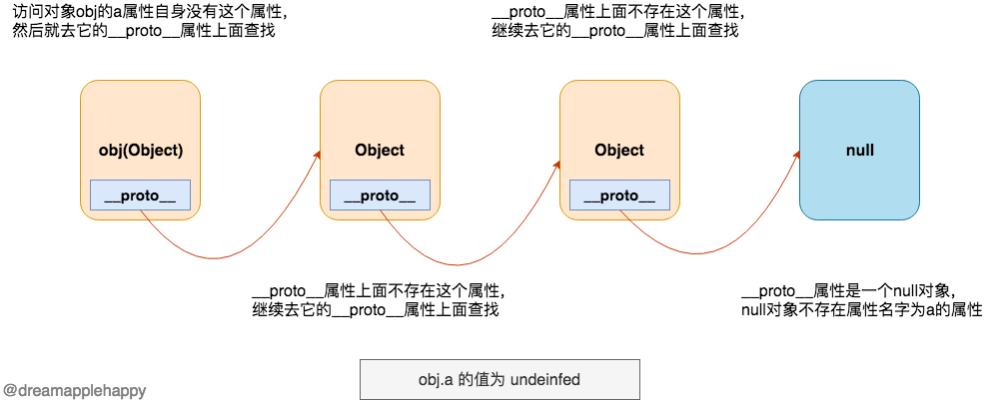

##### 1. __proto__和prototype

**__proto__和prototype这两个属性是我们理解JS原型的关键；**

首先来说一下__proto__这个属性，我们需要知道的是，除了null和undefined，JavaScript中的所有数据类型都有这个属性；

它表示的意义是：当我们访问一个对象的某个属性的时候，如果这个对象自身不存在这个属性，那么就从这个对象的__proto__(为了方便下面描述，这里暂且把这个属性称作p0)属性上面继续查找这个属性，如果p0上面还存在__proto__(p1)属性的话，那么就会继续在p1上面查找响应的属性，直到查找到这个属性，或者没有__proto__属性为止。 我们可以用下面这两幅图来表示：




**我们把一个对象的__proto__属性所指向的对象，叫做这个对象的原型，由原型组成的链式结构定义为原型链**

那么上面两个图就表示我们在obj的原型链上分别找到和没有找到属性名字是a的值；

```
// 修改一个Number类型的值的原型
const num = 1
num.__proto__.name = "My name is 1"
console.log(num.name); // My name is 1

// 修改一个对象的原型
const obj = {}
obj.__proto__.name = "hahaha";
console.log(obj.name); // hahaha
```

> 这里需要特别注意的是，__proto__这个属性虽然被大多数的浏览器支持，但是其实它仅在ECMAScript 2015 规范中被准确的定义， 目的是为了给这个传统的功能定制一个标准，以确保浏览器之间的兼容性。通过使用__proto__属性来修改一个对象的原型是非常慢且影响性能的一种操作。 所以，现在如果我们想要获取一个对象的原型，推荐使用Object.getPrototypeOf 或者Reflect.getPrototypeOf，设置一个对象的原型推荐使用Object.setPrototypeOf或者是Reflect.setPrototypeOf。

说完__proto__，接下来我们就要好好的来理解一下prototype属性；首先我们需要记住的是，这个属性一般只存在于函数对象上面；只要是能够作为构造器的函数，他们都包含这个属性。也就是说，只要这个函数能够通过使用new操作符来生成一个新的对象， 那么这个函数肯定具有prototype属性。**因为我们自定义的函数都可以通过new操作符生成一个对象，所以我们自定义的函数都有prototype 这个属性。**

```
// 函数字面量
console.log((function(){}).prototype); // {constructor: ƒ}

// Date构造器
console.log(Date.prototype); // {constructor: ƒ, toString: ƒ, toDateString: ƒ, toTimeString: ƒ, toISOString: ƒ, …}

// Math.abs 不是构造器，不能通过new操作符生成一个新的对象，所以不含有prototype属性
console.log(Math.abs.prototype); // undefined
```

那这个prototype属性有什么作用呢？这个prototype属性的作用就是：**函数通过使用new操作符生成的一个实例对象， 这个实例对象的原型对象(也就是__proto__)指向该函数的prototype属性。** 那么一个比较简洁的表示__proto__和prototype属性之间关系的等式也就出来了，如下所示：

```
// 其中F表示一个自定义的函数或者是含有prototype属性的内置函数
new F().__proto__ === F.prototype // true
```

通过上面的介绍，我们对__proto__和prototype有了定义上的了解，那么接下来我们通过图解来更加深刻认识两者之间的关系；

##### 2. 图解原型链

###### 2.1 '铁三角关系'（重点）

```
function Person() {}
const p = new Person()
```


这个图描述了构造函数，实例对象和原型三者之间的关系，是原型链的基础：
1. 实例对象由构造函数new产生
2. 构造函数的原型属性与实例对象的原型对象均指向原型
3. 原型对象中有一个属性constructor指向对应的构造函数

原型链：p --> Person.prototype

描述：实例对象能够访问到 Person.prototype 中不同名的属性和方法

验证：
```
p instanceof Person; // true
  
p.__proto__ === Person.prototype; // true
  
Person.prototype.constructor === Person; // true
```

###### 2.2 以原型为构造函数


原型链：p --> Person.prototype --> Object.prototype --> null

描述：
1. 由于构造函数的原型也是对象，因此：它也有原型对象，指向Object.prototype
2. 由于构造函数的原型的原型也是对象，因此：它也有原型对象，指向null（特例）

验证：

```
p instanceof Person; // true
p instanceof Object; // true
 
Person.prototype instanceof Object; // true
```

###### 2.3 深入研究，引出Function构造函数


原型链1：见2.2中的原型

原型链2：p --> Person.prototype --> Object.prototype --> null

描述：
1. 构造函数Person作为实例对象时，Person = new Function()隐式调用，因此Person --> Function.prototype
2. 由于Function.prototype也是对象，Function.prototype = new Object()隐式调用，因此Function.prototype --> Object.prototype

验证：

```
Person instanceof Function; // true
Person instanceof Object; // true
Function.prototype instanceof Object; // true
```

原型链3：Function --> Function.prototype --> Object.prototype --> null

描述：

构造函数Function作为实例对象时，Function = new Function()隐式调用，因此Function --> Function.prototype


Function 这条原型链是最为特殊的“铁三角关系”，理解Function = new Function()就非常好理解了

验证：

```
Function.__proto__ === Function.prototype; // true
Function instanceof Function; // true
Function instanceof Object; // true
```

###### 2.4 完整的原型链


图中新增了Object = new Function()的逻辑

验证：

```
Object instanceof Function;// true
```

几个结论：
1. 对象都有原型对象，对象默认继承自其原型对象
2. 所有的函数都是 Function 的实例
3. 所有的原型链尾端都会指向Object.prototype

##### 3. 原型链改写（重点）

> **当实例对象被创建时，其原型链就已经确定了，当其对应的原型属性指向改变时，也无法改变原型链**

```
function Person({ name="小A", age=21 } = {}) {
    this.name = name;
    this.age = age;
};

// 情况1：在修改原型属性前实例化对象
const p1 = new Person();

// 添加原型属性(方法)
Person.prototype.sayName = function() {
  console.log(this.name);
}

// 情况2：在修改原型属性后实例化对象
const p2 = new Person();

p1.sayName(); // "小A"
p2.sayName(); // "小A"
```

实例对象p1和实例对象p2的原型链相同，为
> p1(p2) --> Person.prototype --> Object.prototype

由于是在原有原型对象上添加的方法，相当于对象的扩展，故两个实例对象均能执行该方法


```
function Person({ name="小A", age=21 } = {}) {
    this.name = name;
    this.age = age;
};

// 情况1：在修改原型属性前实例化对象
const p1 = new Person();

// 重写原型对象
Person.prototype = {
    sayName: function() {
        console.log(this.name);
    }
}

// 情况2：在修改原型属性后实例化对象
const p2 = new Person();

p2.sayName(); // "小A"
p1.sayName(); // p1.sayName is not a function
```

重写原型对象的方式，会改变实例对象的原型链，如下图所示：


但是，为什么p1的原型链没有变，而p2的原型链变了呢？

**当实例对象被创建时，其原型链就已经确定了，当其对应的原型属性指向改变时，也无法改变原型链**

原型链是以实例对象为核心的，不能被原型对象的改变而误导

##### 4. 对象与函数（重点）

看到这里，我们可能已经分不清函数与对象了，思考30秒，函数与对象是什么关系？
> 官方定义: 在Javascript中,每一个函数实际上都是一个函数对象

```
function fn() {};
const obj = {};

fn instanceof Object; // true
fn instanceof Function; // true

obj instanceof Object; // true
obj instanceof Function; // false
```

原型链解释：

fn对应的原型链：fn --> Function.prototype --> Object.prototype

obj对应的原型链：obj --> Object.prototype

从函数的定义来说: **在javascript中一切函数实际都是函数对象，但对象不一定是函数**

```
Function instanceof Object; // true
Object instanceof Function; // true

Function instanceof Function; // true
```

原型链解释：

Function对应的原型链（Function作为实例对象）：Function --> Function.prototype --> Object.prototype

Object对应的原型链（Object作为实例对象）：Object --> Function.prototype --> Object.prototype

由于Function和Object都是构造函数，在内置对象中，均会调用new Function()的方法

结论：
1. 函数一定是对象，但是对象不一定是函数
2. 对象都是由函数来创建的

针对第一点，这两个原型链可验证：
> fn --> Function.prototype --> Object.prototype
>
> obj --> Object.prototype

针对第二点，可这样验证：

```
const obj = { a: 1, b: 2 }
const arr = [2, 'foo', false]

// 实际过程
const obj = new Object()
obj.a = 1
obj.b = 2

const arr = new Array()
arr[0] = 2
arr[1] = 'foo'
arr[2] = false

//typeof Object === 'function'  
//typeof Array === 'function
```

##### 5. 属性搜索原则和属性来源判断
###### 5.1 属性搜索原则（重点）
> 当代码读取某个对象的某个属性时，都会执行一次搜索，目标是具有给定名字的属性。搜索先从对象实例本身开始，如果在实例中找到了具有给定名字的属性，则返回该属性的值；如果没有找到，则继续搜索指针指向的原型对象，在原型对象中查找具有给定名字的属性。如果在原型对象中找到了这个属性，则返回这个属性，如果没有找到，则继续在这个原型对象的原型对象中查找，直到找到这个属性，否则返回undefined

简言之，**沿着对象的原型链查找属性，返回最近的属性，这就是属性搜索原则**

```
function Person(){}

Person.prototype.name = "haha";
Person.prototype.age = 24;
Person.prototype.job = "Software Engineer";
Person.prototype.sayName = function(){
    console.log(this.name);
};

const person1 = new Person();
const person2 = new Person();

person1.name = "hehe";
console.log(person1.name); //"hehe" 来自实例
console.log(person2.name); //"haha" 来自原型
```

同样的，这也是属性屏蔽的原则

> 当为对象实例添加一个属性时，这个属性就会屏蔽原型对象中保存的同名属性，换句话说，添加这个属性只会阻止我们访问原型中的那个属性，但不会修改那个属性。即使将这个属性设置为null，也只会在实例中设置这个属性，而不会恢复其指向原型的链接。不过使用delete操作符则可以完全删除实例属性，从而让我们能够重新访问原型中的属性。

```
// 接着上面的例子
delete person1.name;
console.log(person1.name); // "haha" 来自原型
```

###### 5.2 hasOwnProperty()方法与in操作符

> 使用hasOwnProperty()方法可以检测一个属性是存在于实例中，还是在原型中，这个方法只在给定属性存在于对象实例中时，才会返回true

```
function Person(){}

Person.prototype.name = "haha";
Person.prototype.age = 24;
Person.prototype.job = "Software Engineer";
Person.prototype.sayName = function(){
    console.log(this.name);
};

const person1 = new Person();
const person2 = new Person();

console.log(person1.hasOwnProperty("name")); // false

person1.name = "hehe";
console.log(person1.name); //"hehe" 来自实例
console.log(person1.hasOwnProperty("name")); // true

console.log(person2.name); //"haha" 来自原型
console.log(person2.hasOwnProperty("name")); // false

delete person1.name;
console.log(person1.name); // "haha" 来自原型
console.log(person1.hasOwnProperty("name")); // false
```

> 有两种方式使用in操作符：单独使用和在for-in循环中使用。在单独使用时，in操作符会在通过对象能够访问给定属性时返回true，无论该属性存在于实例中还是原型中

因此，同时使用hasOwnProperty()和in操作符，就可以确定某个属性到底是存在于对象中还是存在于原型中

```
function hasPrototypeProperty(object, name){
    return !object.hasOwnProperty(name) && (name in object);
}
```

顺便一提，由于in操作符会在整个原型链上查找属性，处于性能考虑，在使用for-in循环时，建议多加一层判别

```
function Person(){}

Person.prototype.name = "haha";
Person.prototype.age = 24;

const p = new Person();
p.sex = "male";

for (key in p) {
    console.log(key); // sex name age 
}

// 实际上，我们一般只是在查找实例中的属性
for (key in p) {
  if (p.hasOwnProperty(key)) {
        console.log(key); // sex 屏蔽了原型中的属性
  }
}

```

###### 5.3 instanceof操作符
> instanceof 用来判断一个构造函数的prototype属性所指向的对象是否存在另外一个要检测对象的原型链上

更形象来说，对于 A instanceof B来说，它的判断规则是：沿着A的__proto__这条线来找，同时沿着B的prototype这条线来找，如果两条线能找到同一个引用，即同一个对象，那么就返回true。如果找到终点还未重合，则返回false。

```
function Person() {}
const p = new Person();
console.log(p instanceof Person);//true
console.log(p instanceof Function);//true
console.log(p instanceof Object);//true
```

结合2.4中完整的原型链图解可以更好的理解

