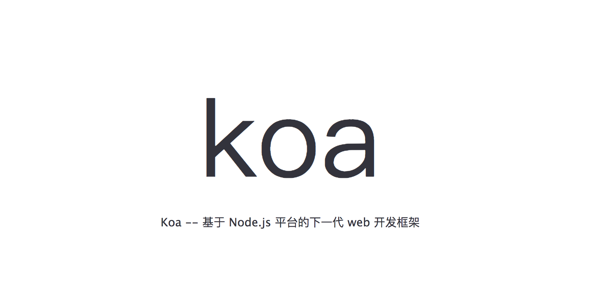
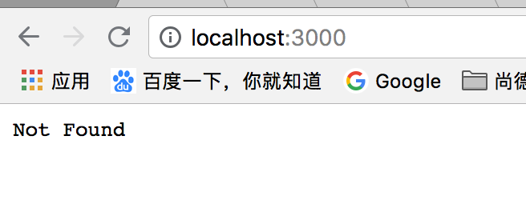
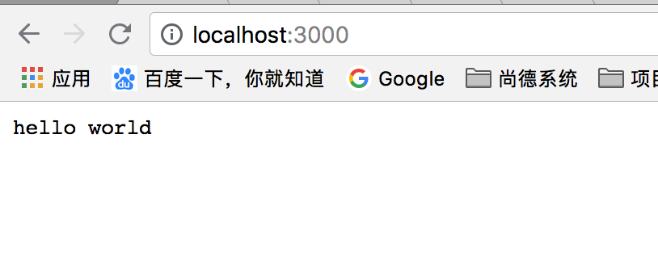
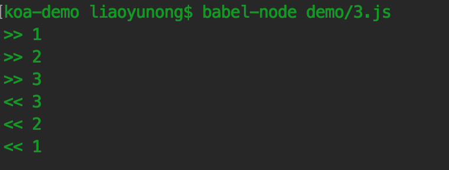
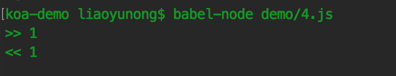
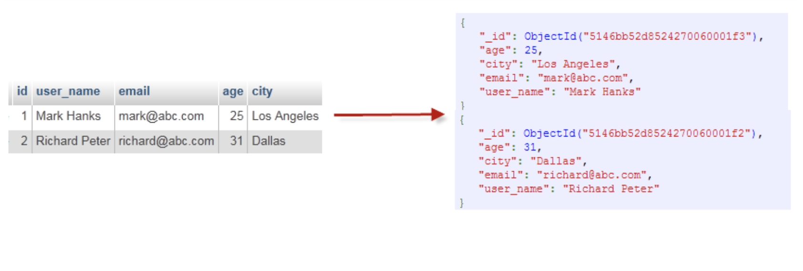
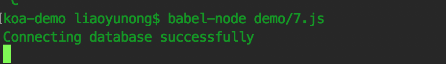
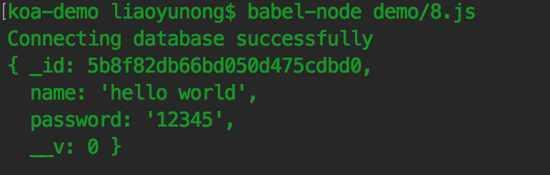
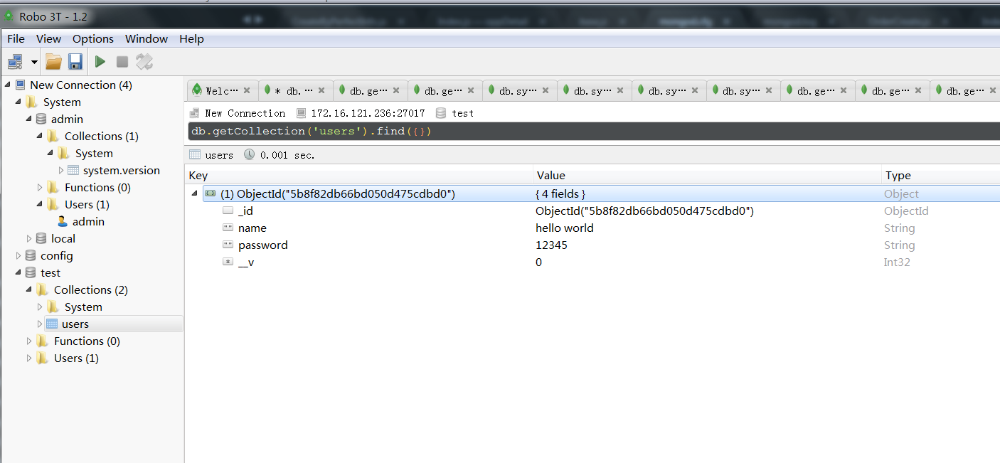

##### 一、Koa是什么

Koa 是一个新的 web 框架，由 Express 原班人马打造， 致力于成为 web 应用和 API 开发领域中的一个更小、更富有表现力、更健壮的基石。 通过利用 async 函数，Koa 帮你丢弃回调函数，并有力地增强错误处理。 Koa 不在内核方法中绑定任何中间件，它仅仅提供了一个轻量优雅的函数库，使得编写 Web 应用和API变得得心应手。总结来说，Koa的特点是优雅、简洁、表达力强、自由度高。

Koa有V1.0和V2.0两个版本，V2.0是在Node7.6.0版本支持async和await后才正式发布的，本文的Koa均指Koa2。

##### 二、快速开始

Koa依赖Node V7.6.0及以上版本来对async方法做支持，所以推荐升级Node，如果想在node < 7.6 版本的 Koa 中使用 async 方法，那么就需要在.babelrc 文件中进行相应的配置，比如在plugin中增加transform-async-to-generator，也可以配置其他选项，具体配置可以参考[env preset ](https://babel.bootcss.com/docs/plugins/preset-env/)，这里不做赘述。确认好开发环境后，就可以自由操练了，克隆gitlab上的事例库，进入 koa-demo  目录，然后安装依赖即可。
```
{
  "plugins": ["transform-async-to-generator"]
}
```

```
git clone http://172.16.117.224/fe/ND-Share.git
```

##### 三、基本用法

###### 3.1 架设HTTP服务
只需要三行代码，就可以用Koa架设一个http服务

```
import Koa from 'koa'

const app = new Koa()

app.listen(3000)
```
运行这个脚本

```
babel-node demo/1.js
```
> 这里我们使用babel-node命令而不是node命令是因为无法在node环境直接运行ES6代码，目前有三种解决方案：

1.使用require来引入模块；

```
const Koa = require('koa')
const app = new Koa()
app.listen(3000)
```

2.全局安装babel-cli，babel相关知识可以参考阮大神的[Babel 入门教程](http://www.ruanyifeng.com/blog/2016/01/babel.html)；

```
sudo npm install -g babel-cli
```

3.在package.json中添加script命令

```
"scripts": {
    "start": "babel-node demo/2.js"
},

npm run start
```

然后浏览器访问[http://localhost:3000/](http://localhost:3000/)，可以看到页面显示“Not Found”，这是因为我们并没有给koa指定输出什么内容。就是这么简单的几行代码，我们就起了一个HTTP服务。



###### 3.2 必修的hello world

```
import Koa from 'koa'

const app = new Koa()

app.use(async ctx => {
    ctx.body = 'hello world'
})

app.listen(3000)
```
再次访问[http://localhost:3000/](http://localhost:3000/)，就可以看到亲切的hello world了，



这个hello world程序，其中前两行和后一行是架设一个 HTTP 服务，中间的则是对用户访问的处理。ctx则是Koa所提供的Context对象(上下文)，ctx.body=ctx.response.body，是ctx.response.body的alias(别名)。

###### 3.3 Context对象

Koa 提供一个 Context 对象，表示一次对话的上下文（包括 HTTP 请求和 HTTP 回复）。通过加工这个对象，就可以控制返回给用户的内容。Koa 的 Context 把 node 的 request, response 对象封装进一个单独对象, 并提供许多开发 web 应用和 APIs 有用的方法。每个请求会创建属于此请求的ctx对象，并且ctx对象会在koa中间件中传递。为方便起见许多上下文的访问器和方法直接委托给它们的 ctx.request或 ctx.response ，不然的话它们是相同的。 例如 ctx.type 和 ctx.length 委托给 response 对象，ctx.path 和 ctx.method 委托给 request。（更多的api可以查阅[官网](https://koa.bootcss.com/#)）

###### 3.4 middleware中间件

Koa 的最大特色，也是最重要的一个设计，就是中间件（middleware）。Koa 应用程序是一个包含一组中间件函数的对象，它是按照类似堆栈的方式组织和执行的。Koa中使用app.use()用来加载中间件，基本上Koa 所有的功能都是通过中间件实现的。每个中间件默认接受两个参数，第一个参数是 Context 对象，第二个参数是next函数。只要调用next函数，就可以把执行权转交给下一个中间件。

让我们再仔细看看koa的执行逻辑。核心代码是：

```
app.use(async (ctx, next) => {
    await next()
    ctx.body = 'hello world'
})
```
每收到一个http请求，koa就会调用通过app.use()注册的async函数，并传入ctx和next参数。ctx对象可以用来控制返回，next函数用来转移控制权，以此形成一个处理链，这样每一个async函数可以做一些自己的事情，然后通过next进行集联，来完成各种花式功能。

多个中间件会形成一个栈结构（middle stack）。当一个中间件调用 next() 则该函数暂停并将控制传递给定义的下一个中间件。当在下游没有更多的中间件执行后，堆栈将展开并且每个中间件恢复执行其上游行为。过程可以描述为：
1. 最外层的中间件首先执行。
2. 调用next函数，把执行权交给下一个中间件。
3. ...
4. 最内层的中间件最后执行。
5. 执行结束后，把执行权交回上一层的中间件。
6. ...
7. 最外层的中间件收回执行权之后，执行next函数后面的代码。

来看一下下面这个例子：

```
import Koa from 'koa'

const app=new Koa()

app.use(async (ctx, next) => {
    console.log('>> 1')
    await next()
    console.log('<< 1')
})

app.use(async (ctx, next) => {
    console.log('>> 2')
    await next()
    console.log('<< 2')
})

app.use(async (ctx, next) => {
    console.log('>> 3')
    await next()
    console.log('<< 3')
})

app.listen(3000)
```
运行脚本

```
babel-node demo/3.js
```
访问 [http://localhost:3000](http://localhost:3000) ，命令行窗口会输出：

```
>> 1
>> 2
>> 3
<< 3
<< 2
<< 1
```



此外，如果一个middleware没有调用await next()，会怎么办？答案是后续的middleware将不再执行了。仍然是上面那个例子，将第一个中间件的next函数注释掉

```
import Koa from 'koa'

const app=new Koa()

app.use(async (ctx, next) => {
    console.log('>> 1')
    // await next()
    console.log('<< 1')
})

app.use(async (ctx, next) => {
    console.log('>> 2')
    await next()
    console.log('<< 2')
})

app.use(async (ctx, next) => {
    console.log('>> 3')
    await next()
    console.log('<< 3')
})

app.listen(3000)
```

运行脚本，然后访问 [http://localhost:3000 ](http://localhost:3000/)，命令行窗口会输出：

```
>> 1
<< 1
```


可见Koa在执行完第一个中间件后，由于没有接收到next函数的调用来传递控制权，后续的中间件将不再执行了。这种情况也很常见，例如，一个检测用户权限的中间件可以决定是否继续处理请求，还是直接返回403错误：

```
app.use(async (ctx, next) => {
    if (await checkUserPermission(ctx)) {
        await next()
    } else {
        ctx.response.status = 403
    }
})
```
Koa已经有了很多实用的中间件，[https://github.com/koajs/koa/wiki#middleware](https://github.com/koajs/koa/wiki#middleware)上日常需要的中间件基本都有好心人实现了。

###### 3.5 错误处理

如果代码运行过程中发生错误，我们需要把错误信息返回给用户。HTTP 协定约定这时要返回500状态码。Koa 提供了ctx.throw()方法，用来抛出错误，ctx.throw(500)就是抛出500错误。

```
import Koa from 'koa'

const app = new Koa()

app.use(async ctx => {
    ctx.throw(500)
})

app.listen(3000)
```
运行这个demo

```
babel-node demo/5.js
```
访问[http://localhost:3000/](http://localhost:3000/)，就会看到500错误页"Internal Server Error"。

当然我们也可以设置response的status，比如

```
app.use(async ctx => {
    ctx.status = 500
})
```

##### 四、MongoDB


###### 4.1 MongoDB简介

MongoDB 是一个基于分布式文件存储的数据库。由 C++ 语言编写。旨在为 WEB 应用提供可扩展的高性能数据存储解决方案。

MongoDB 是一个介于关系数据库和非关系数据库之间的产品，是非关系数据库当中功能最丰富，最像关系数据库的。它支持的数据结构非常松散，是类似json的bson格式，因此可以存储比较复杂的数据类型。Mongo最大的特点是它支持的查询语言非常强大，其语法有点类似于面向对象的查询语言，几乎可以实现类似关系数据库单表查询的绝大部分功能，而且还支持对数据建立索引。

###### 4.2 设计特征

MongoDB 的设计目标是高性能、可扩展、易部署、易使用，存储数据非常方便。其主要功能特性如下:

1. 面向集合存储，容易存储对象类型的数据。在MongoDB 中数据被分组存储在集合中，集合类似RDBMS 中的表，一个集合中可以存储无限多的文档。
2. 模式自由，采用无模式结构存储。在MongoDB 中集合中存储的数据是无模式的文档，采用无模式存储数据是集合区别于RDBMS 中的表的一个重要特征。
3. 支持完全索引，可以在任意属性上建立索引，包含内部对象。MongoDB的索引和RDBMS 的索引基本一样，可以在指定属性、内部对象上创建索引以提高查询的速度。除此之外，MongoDB 还提供创建基于地理空间的索引的能力。
4. 支持查询。MongoDB 支持丰富的查询操作，MongoDB 几乎支持SQL中的大部分查询。
5. 强大的聚合工具。MongoDB 除了提供丰富的查询功能外，还提供强大的聚合工具，如count、group 等，支持使用MapReduce 完成复杂的聚合任务。
6. 支持复制和数据恢复。MongoDB 支持主从复制机制，可以实现数据备份、故障恢复、读扩展等功能。而基于副本集的复制机制提供了自动故障恢复的功能，确保了集群数据不会丢失。
7. 使用高效的二进制数据存储，包括大型对象（如视频）。使用二进制格式存储，可以保存任何类型的数据对象。
8. 自动处理分片，以支持云计算层次的扩展。MongoDB 支持集群自动切分数据，对数据进行分片可以使集群存储更多的数据，实现更大的负载，也能保证存储的负载均衡。
9. 支持Perl、PHP、Java、C#、JavaScript、Ruby、C 和C++语言的驱动程序，MongoDB 提供了当前所有主流开发语言的数据库驱动包，开发人员使用任何一种主流开发语言都可以轻松编程，实现访问MongoDB 数据库。
10. 文件存储格式为BSON（JSON 的一种扩展）。BSON 是对二进制格式的JSON 的简称，BSON 支持文档和数组的嵌套。
11. 可以通过网络访问。可以通过网络远程访问MongoDB 数据库。

###### 4.3 基本概念

1.文档

> 文档是 MongoDB 中数据的基本单位，类似于关系数据库中的行（但是比行复杂）。多个键及其关联的值有序地放在一起就构成了文档。不同的编程语言对文档的表示方法不同，在JavaScript 中文档表示为：


```
{"greeting": "hello world"}
```

> 这个文档只有一个键“greeting”，对应的值为“hello world”。多数情况下，文档比这个更复杂，它包含多个键/值对。例如：

```
{"greeting": "hello world", "foo": 3}
```

文档中的键/值对是有序的，下面的文档与上面的文档是完全不同的两个文档。

```
{"foo": 3, "greeting": "hello world"}
```

> 文档中的值不仅可以是双引号中的字符串，也可以是其他的数据类型，例如，整型、布尔型等，也可以是另外一个文档，即文档可以嵌套。文档中的键类型只能是字符串。

2.集合

> 集合就是一组文档，类似于关系数据库中的表。集合是无模式的，集合中的文档可以是各式各样的。例如，

```
{"hello word": "Mike"}  {"foo": 3}
```
> 它们的键不同，值的类型也不同，但是它们可以存放在同一个集合中，也就是不同模式的文档都可以放在同一个集合中。既然集合中可以存放任何类型的文档，那么为什么还需要使用多个集合？这是因为所有文档都放在同一个集合中，无论对于开发者还是管理员，都很难对集合进行管理，而且这种情形下，对集合的查询等操作效率都不高。所以在实际使用中，往往将文档分类存放在不同的集合中，例如，对于网站的日志记录，可以根据日志的级别进行存储，Info级别日志存放在Info 集合中，Debug 级别日志存放在Debug 集合中，这样既方便了管理，也提供了查询性能。但是需要注意的是，这种对文档进行划分来分别存储并不是MongoDB 的强制要求，用户可以灵活选择。
可以使用“.”按照命名空间将集合划分为子集合。例如，对于一个博客系统，可能包括blog.user 和blog.article 两个子集合，这样划分只是让组织结构更好一些，blog 集合和blog.user、blog.article 没有任何关系。虽然子集合没有任何特殊的地方，但是使用子集合组织数据结构清晰，这也是MongoDB 推荐的方法。

3.数据库

> MongoDB 中多个文档组成集合，多个集合组成数据库。一个MongoDB 实例可以承载多个数据库。它们之间可以看作相互独立，每个数据库都有独立的权限控制。在磁盘上，不同的数据库存放在不同的文件中。MongoDB 中存在以下系统数据库。

- Admin 数据库：一个权限数据库，如果创建用户的时候将该用户添加到admin 数据库中，那么该用户就自动继承了所有数据库的权限。
- Local 数据库：这个数据库永远不会被负责，可以用来存储本地单台服务器的任意集合。
- Config 数据库：当MongoDB 使用分片模式时，config 数据库在内部使用，用于保存分片的信息。

4.4 MongoDB与mysql的一些简单对比

1.概念对比

MySQL | MongoDB | 说明
---|---|---
database | database | 数据库
table |	collection | 表/集合
row | document | 行/文档
column | field | 列/字段
table joins | 嵌入文档 | 表连接/嵌入文档
primary key | primary key |	主键,MongoDB自动将_id字段设置为主键

下图可以更直观的理解：



2.特色对比

| | MySQL | MongoDB
--- | --- | ---
丰富的数据模型 | 否 | 是
动态Schema | 否 | 是
数据类型 | 是 |	是
数据本地化 | 否 | 是
字段更新 | 是 | 是
易于编程 | 否 | 是
复杂事务 | 是 | 否
审计 | 是 | 是
自动分片 | 否 | 是

3.查询语言对比

MySQL和MongoDB都有丰富的查询语言。具体的查询语言比对可以查看 [MongoDB文档](https://docs.mongodb.com/manual/reference/sql-comparison/?_ga=2.97293983.1414641971.1500188964-1583439788.1500188964)


###### 4.5 Mongoose

前面介绍了Koa和MongoDB，那么我们怎么在Koa中对MongoDB进行操作呢？这里就需要介绍一下Mongoose了。

Mongoose是MongoDB的一个对象模型工具，是基于node-mongodb-native开发的MongoDB nodejs驱动，可以在异步的环境下执行。同时它也是针对MongoDB操作的一个对象模型库，封装了MongoDB对文档的的一些增删改查等常用方法，让NodeJS操作Mongodb数据库变得更加灵活简单。

下面的代码简单的演示如何在Koa中连接MongoDB：
```
import Koa from 'koa'
import mongoose from 'mongoose'

const app = new Koa()

const db = 'mongodb://172.16.121.236:27017/test'

mongoose.connect(db, { useNewUrlParser: true }, err => {
    if (err) {
        console.error('Failed to connect to database');
    } else {
        console.log('Connecting database successfully');
    }
});

app.listen(3000)
```
首先，我在ip为172.16.121.236的机器上安装并启动了MongoDB数据库，具体的安装这里就不赘述了，可以参考 [MongoDB教程](http://www.runoob.com/mongodb/mongodb-tutorial.html)，里面有非常详细的介绍，需要注意的是，启动mongodb的时候我指定了bind_ip,因为mongodb默认的ip是localhost，这样是没办法远程链接数据库

```
mongod.exe --dbpath E:\db\data --logpath E:\db\log\mongod.log  --bind_ip 172.16.121.236
```
dbpath指定数据库数据存储位置，logpath指定日志存储位置，bind_ip指定绑定ip，具体参数说明可以参考 [MongoDB文档](https://docs.mongodb.com/manual/reference/configuration-options/#net-options)和 [MongoDB 远程连接](https://blog.csdn.net/baidu_19473529/article/details/79434581)

然后运行脚本

```
babel-node demo/7.js
```
可以在命令行窗口看到Connecting database successfully，表示数据库连接成功。



Mongooose中，有三个比较重要的概念，分别是Schema、Model、Entity。

- Schema

Schema是一种以文件形式存储的数据库模型骨架，无法直接通往数据库端，也就是说它不具备对数据库的操作能力，仅仅只是定义数据库模型在程序片段中的一种表现，可以说是数据属性模型(传统意义的表结构)，又或着是“集合”的模型骨架。简单的理解就是：Schema是对文档(表)结构的定义。

那么如何去定义一个Schema呢，可以看下下面的事例

```
const UserSchema = new mongoose.Schema({
    name: {
        type: String,
        required: true
    },
    password: {
        type: String,
        required: true
    },
})
```

- Model

模型(Model)是由Schema构造生成的模型，除了Schema定义的数据库骨架以外，还具有数据库操作的行为，类似于管理数据库属性、行为的类。

如何通过Schema来创建Model呢，如下示例：

```
const UserModel = mongoose.model('User', UserSchema)
```
User是模型名称，它对应到mongodb里就是数据库中的集合名称，默认会转成复数，变为’users’,当我们对其添加数据时如果users已经存在，则会保存到其目录下，如果未存在，则会创建users集合，然后在保存数据。当然如果我们想指定集合的名称，可以在定义Schema的时候指定，比如：

```
const UserSchema = new mongoose.Schema({
    name: {
        type: String,
        required: true
    },
    password: {
        type: String,
        required: true
    },
}, {
    collection: 'user'
})
```


- Entity

实体(Entity)是由Model创建的实体，使用save方法保存数据，Model和Entity都有能影响数据库的操作，但Model比Entity更具操作性。

使用Model创建Entity，如下示例：

```
const user = new MyModel({
    name: 'hello world',
    password: '12345'
})
user.save((err, doc) => {
    console.log(doc)
})
```
创建成功之后，Schema属性就变成了Model和Entity的公共属性了。我们可以通过调用实体的save方法来在数据库中保存创造的数据。完整例子如下：

```
import Koa from 'koa'
import mongoose from 'mongoose'
const app = new Koa()

const db = 'mongodb://172.16.121.236:27017/test'

mongoose.connect(db, { useNewUrlParser: true }, err => {
    if (err) {
        console.error('Failed to connect to database')
    } else {
        console.log('Connecting database successfully')
        const UserSchema = new mongoose.Schema({
            name: {
                type: String,
                required: true
            },
            password: {
                type: String,
                required: true
            },
        })
        const UserModel = mongoose.model('User', UserSchema)
        const user = new MyModel({
            name: 'hello world',
            password: '12345'
        })
        user.save((err, doc) => {
            console.log(doc)
        })
    }
})

app.listen(3000)
```
运行脚本

```
babel-node demo/8.js
```
命令行窗口会输出



然后再查看一下数据库，看数据是否保存了，这里我使用  [Robo 3T](https://robomongo.org/)可视化工具来管理数据库



可以看出test数据库下新增了一个名叫users的Collection，里面新增了一份文档，具体内容就是刚刚实例化并保存的user数据。
